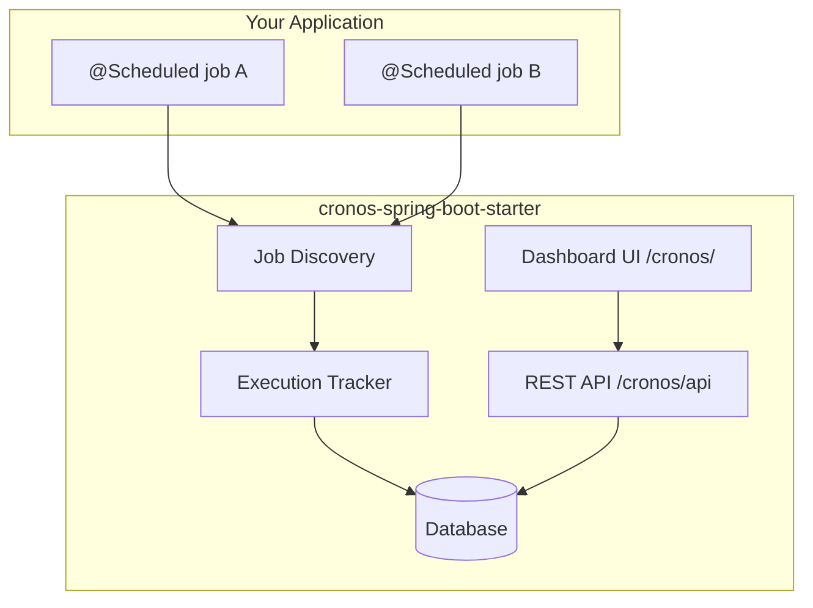

<p align="center">
  
</p>

<p align="center">
  <a href="https://jitpack.io/#ibrahimbayramli/cronos"></a>
  <a href="https://github.com/ibrahimbayramli/cronos/releases/tag/v0.1.1"></a>
  <a href="https://github.com/ibrahimbayramli/cronos/actions/workflows/publish.yml"></a>
  
  
</p>

<p align="center">
  <strong>Cronos</strong> is a zero-config starter that discovers your scheduled jobs at runtime,
  tracks every execution, exposes a REST API, and ships an embedded dashboard — without changing your job code.
</p>

---

## What does Cronos do?

You already have `@Scheduled` jobs in your app. Cronos plugs in as a dependency and automatically:

| Capability | Description |
|---|---|
| **Discovery** | Finds all `@Scheduled` methods when the app starts |
| **Tracking** | Records start/end time, duration, status, and errors |
| **Dashboard** | Serves an embedded UI at `/cronos/` |
| **REST API** | Exposes jobs, history, health, and manual trigger at `/cronos/api` |
| **Persistence** | Stores execution history in an embedded database (zero config) or your own database |



> **No code changes required.** Add the dependency, keep `@EnableScheduling`, run your app.

---

## Quick install (no token required)

Add **one dependency** via [JitPack](https://jitpack.io/#ibrahimbayramli/cronos) — no GitHub username, password, or `settings.xml` needed.

### Maven

```xml
<repositories>
    <repository>
        <id>jitpack.io</id>
        <url>https://jitpack.io</url>
    </repository>
</repositories>

<dependencies>
    <dependency>
        <groupId>com.github.ibrahimbayramli</groupId>
        <artifactId>cronos-spring-boot-starter</artifactId>
        <version>v0.1.1</version>
    </dependency>
</dependencies>
```

### Gradle

```kotlin
repositories {
    mavenCentral()
    maven { url = uri("https://jitpack.io") }
}

dependencies {
    implementation("com.github.ibrahimbayramli:cronos-spring-boot-starter:v0.1.1")
}
```

Enable scheduling and run:

```java
@SpringBootApplication
@EnableScheduling
public class MyApplication {
    public static void main(String[] args) {
        SpringApplication.run(MyApplication.class, args);
    }
}
```

Open **http://localhost:8080/cronos/** (or the port you configure below).

---

## Published artifacts

| Registry | Coordinates | Auth required |
|---|---|---|
| **JitPack** (recommended) | `com.github.ibrahimbayramli:cronos-spring-boot-starter:v0.1.1` | No |
| GitHub Packages | `dev.cronos:cronos-spring-boot-starter:0.1.1` | Yes (`read:packages` token) |

---

## Installation (GitHub Packages)

Use this only if you prefer GitHub Packages over JitPack.

### Prerequisites

1. A GitHub account with access to this repository
2. A [Personal Access Token (classic)](https://github.com/settings/tokens) with `read:packages` scope
3. Java 17+

### Maven

**Step 1 — Add the GitHub Packages repository** to `pom.xml`:

```xml
<repositories>
    <repository>
        <id>github-cronos</id>
        <url>https://maven.pkg.github.com/ibrahimbayramli/cronos</url>
    </repository>
</repositories>
```

**Step 2 — Add credentials** to `~/.m2/settings.xml`:

```xml
<settings>
  <servers>
    <server>
      <id>github-cronos</id>
      <username>YOUR_GITHUB_USERNAME</username>
      <password>YOUR_GITHUB_TOKEN</password>
    </server>
  </servers>
</settings>
```

> The `<id>` must match the repository `<id>` in your `pom.xml`.

**Step 3 — Add the dependency:**

```xml
<dependency>
    <groupId>dev.cronos</groupId>
    <artifactId>cronos-spring-boot-starter</artifactId>
    <version>0.1.1</version>
</dependency>
```

**Step 4 — Enable scheduling** (if not already):

```java
@SpringBootApplication
@EnableScheduling
public class MyApplication {
    public static void main(String[] args) {
        SpringApplication.run(MyApplication.class, args);
    }
}
```

**Step 5 — Run your app:**

```bash
mvn spring-boot:run
```

Open **http://localhost:8080/cronos/** — dashboard and API are live.

---

### Gradle

**Step 1 — Add the repository** in `settings.gradle.kts` (Gradle 7+):

```kotlin
dependencyResolutionManagement {
    repositories {
        mavenCentral()
        maven {
            name = "GitHubPackagesCronos"
            url = uri("https://maven.pkg.github.com/ibrahimbayramli/cronos")
            credentials {
                username = providers.gradleProperty("gpr.user").orNull
                    ?: System.getenv("GITHUB_ACTOR")
                password = providers.gradleProperty("gpr.key").orNull
                    ?: System.getenv("GITHUB_TOKEN")
            }
        }
    }
}
```

Or in `build.gradle.kts` (legacy projects):

```kotlin
repositories {
    mavenCentral()
    maven {
        url = uri("https://maven.pkg.github.com/ibrahimbayramli/cronos")
        credentials {
            username = findProperty("gpr.user") as String? ?: System.getenv("GITHUB_ACTOR")
            password = findProperty("gpr.key") as String? ?: System.getenv("GITHUB_TOKEN")
        }
    }
}
```

**Step 2 — Store credentials** in `~/.gradle/gradle.properties`:

```properties
gpr.user=YOUR_GITHUB_USERNAME
gpr.key=YOUR_GITHUB_TOKEN
```

**Step 3 — Add the dependency** in `build.gradle.kts`:

```kotlin
dependencies {
    implementation("dev.cronos:cronos-spring-boot-starter:0.1.1")
}
```

**Step 4 — Enable scheduling and run:**

```kotlin
// Kotlin example — Java projects use the same annotation
@SpringBootApplication
@EnableScheduling
class MyApplication

fun main(args: Array<String>) {
    runApplication<MyApplication>(*args)
}
```

```bash
./gradlew bootRun
```

Open **http://localhost:8080/cronos/**

---

## What you get out of the box

| Endpoint | URL |
|---|---|
| Dashboard UI | `http://localhost:{port}/cronos/` |
| REST API base | `http://localhost:{port}/cronos/api` |
| Job list | `GET /cronos/api/jobs` |
| Job detail | `GET /cronos/api/jobs/{id}` |
| Execution history | `GET /cronos/api/jobs/{id}/executions` |
| Manual trigger | `POST /cronos/api/jobs/{id}/trigger` |
| Health | `GET /cronos/api/health` |

On startup, Cronos logs the dashboard and API URLs automatically.

---

## Configuration

```yaml
cronos:
  enabled: true
  port: 9090                    # HTTP port for Cronos UI + API (see below)
  api-base-path: /cronos/api
  ui-enabled: true
  ui-base-path: /cronos
  execution-retention: 90d
  manual-trigger-pool-size: 4
  datasource:
    url: jdbc:h2:file:./data/cronos;DB_CLOSE_DELAY=-1
    username: sa
    password: ""
    driver-class-name: org.h2.Driver
```

### Port binding

Cronos UI and API share the host application web server. Configure the port in `application.yml`:

| Scenario | Configuration | Result |
|---|---|---|
| Cronos-only / default | `cronos.port: 9090` | App listens on **9090** |
| Existing app port | `server.port: 8080` | Cronos on **8080** |
| Both ports | `server.port: 8080` + `cronos.port: 9090` | App on **8080**, Cronos also on **9090** (additional connector) |

```yaml
# Example: run everything on port 9090
cronos:
  port: 9090
```

```yaml
# Example: main app on 8080, Cronos also reachable on 9090
server:
  port: 8080
cronos:
  port: 9090
```

On startup, Cronos logs the dashboard and API URLs with the effective port.

When your app already has a `DataSource` bean, Cronos uses it. Otherwise it provisions an embedded database with the datasource settings above.

---

## Project structure

| Module | Description |
|---|---|
| `cronos-core` | Domain entities and `JobSourceAdapter` SPI |
| `cronos-spring-boot-starter` | Auto-configuration, REST API, embedded UI |
| `cronos-dashboard` | Embedded dashboard UI (bundled into starter JAR) |

---

## Building from source

```bash
# Full build (includes dashboard UI)
mvn clean verify

# Skip UI build for faster CI
mvn clean verify -Dcronos.ui.build.skip=true

# Publish to GitHub Packages (maintainers)
export GITHUB_TOKEN=ghp_xxx
export GITHUB_ACTOR=your-username
mvn deploy -DskipTests -s .github/maven/settings.xml

# Or via Gradle wrapper
./gradlew publishToGitHubPackages
```

---

## Roadmap

- [x] Spring `@Scheduled` discovery
- [x] Execution tracking with persistence
- [x] Manual trigger
- [x] REST API
- [x] Embedded dashboard UI
- [x] GitHub Packages (Maven & Gradle)
- [x] JitPack (no-auth install)
- [x] Configurable port (`cronos.port`)
- [ ] WebSocket live updates
- [ ] Quartz adapter
- [ ] API key / JWT auth

---

## License

MIT — see [LICENSE](LICENSE).
