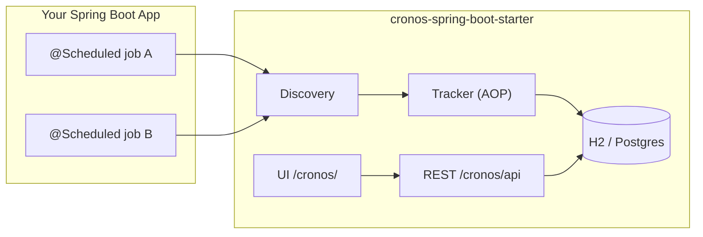

<p align="center">
  
</p>

<p align="center">
  <a href="https://github.com/ibrahimbayramli/cronos/packages"></a>
  <a href="https://github.com/ibrahimbayramli/cronos/releases/tag/v0.1.0"></a>
  <a href="https://github.com/ibrahimbayramli/cronos/actions/workflows/publish.yml"></a>
</p>

<p align="center">
  
  
  
</p>

<p align="center">
  <strong>Cronos</strong> is a zero-config Spring Boot starter that discovers your <code>@Scheduled</code> jobs,
  tracks every execution, exposes a REST API, and ships a modern embedded dashboard — without changing your job code.
</p>

<p align="center">
  <a href="#quick-start">Quick Start</a> ·
  <a href="#add-to-your-project">Add to Your Project</a> ·
  <a href="#published-artifacts">Published Artifacts</a> ·
  <a href="#configuration">Configuration</a>
</p>

---

## What does Cronos do?

Spring Boot apps often run critical background work with `@Scheduled`, but observability is usually an afterthought — no central job list, no execution history, no quick way to trigger a run manually.

Cronos plugs in as a single dependency and automatically:

| Capability | What you get |
|---|---|
| **Discovery** | Finds all `@Scheduled` methods at startup |
| **Tracking** | Records start/end time, duration, status, and stack traces on failure |
| **Dashboard** | Serves a React + Ant Design UI at `/cronos/` |
| **REST API** | Jobs, history, health, and manual trigger at `/cronos/api` |
| **Persistence** | Embedded H2 out of the box, or your app's existing `DataSource` |



> **Zero code changes.** Add the dependency, keep `@EnableScheduling`, start your app.

---

## Quick Start

**1. Add the dependency** (Maven or Gradle — see [Add to your project](#add-to-your-project))

**2. Enable scheduling** (if not already):

```java
@SpringBootApplication
@EnableScheduling
public class MyApplication {
    public static void main(String[] args) {
        SpringApplication.run(MyApplication.class, args);
    }
}
```

**3. Run and open the dashboard:**

```bash
# Maven
mvn spring-boot:run

# Gradle
./gradlew bootRun
```

| Resource | URL |
|---|---|
| Dashboard | http://localhost:8080/cronos/ |
| REST API | http://localhost:8080/cronos/api |
| Health | http://localhost:8080/cronos/api/health |

Cronos logs the dashboard and API URLs on startup.

---

## Published artifacts

Cronos is **deployed to GitHub Packages** and consumed from both **Maven** and **Gradle** projects through the same Maven-compatible registry.

<p align="center">
  
</p>

| Package | Coordinates | Use |
|---|---|---|
| **Starter** (recommended) | `dev.cronos:cronos-spring-boot-starter:0.1.0` | Auto-config, REST API, embedded UI |
| Core | `dev.cronos:cronos-core:0.1.0` | Domain models and SPI (advanced) |

**Registry URL:** `https://maven.pkg.github.com/ibrahimbayramli/cronos`

**Live packages on GitHub:**

- [cronos-spring-boot-starter](https://github.com/ibrahimbayramli/cronos/packages/3114732)
- [cronos-core](https://github.com/users/ibrahimbayramli/packages?repo_name=cronos)
- [All packages](https://github.com/ibrahimbayramli/cronos/packages)
- [Release v0.1.0](https://github.com/ibrahimbayramli/cronos/releases/tag/v0.1.0)

---

## Add to your project

GitHub Packages requires authentication even for public packages. Create a [Personal Access Token (classic)](https://github.com/settings/tokens) with **`read:packages`** scope.

### Maven

<details open>
<summary><strong>Step-by-step</strong></summary>

**1. Repository** — add to your `pom.xml`:

```xml
<repositories>
    <repository>
        <id>github-cronos</id>
        <url>https://maven.pkg.github.com/ibrahimbayramli/cronos</url>
    </repository>
</repositories>
```

**2. Credentials** — add to `~/.m2/settings.xml`:

```xml
<settings>
  <servers>
    <server>
      <id>github-cronos</id>
      <username>YOUR_GITHUB_USERNAME</username>
      <password>YOUR_GITHUB_TOKEN</password>
    </server>
  </servers>
</settings>
```

> The `<server><id>` must match the repository `<id>` in `pom.xml`.

**3. Dependency:**

```xml
<dependency>
    <groupId>dev.cronos</groupId>
    <artifactId>cronos-spring-boot-starter</artifactId>
    <version>0.1.0</version>
</dependency>
```

**4. Sync and run:**

```bash
mvn clean compile
mvn spring-boot:run
```

</details>

### Gradle

<details open>
<summary><strong>Step-by-step</strong></summary>

**1. Repository** — in `settings.gradle.kts` (Gradle 7+, recommended):

```kotlin
dependencyResolutionManagement {
    repositoriesMode.set(RepositoriesMode.FAIL_ON_PROJECT_REPOS)
    repositories {
        mavenCentral()
        maven {
            name = "GitHubPackagesCronos"
            url = uri("https://maven.pkg.github.com/ibrahimbayramli/cronos")
            credentials {
                username = providers.gradleProperty("gpr.user").orNull
                    ?: System.getenv("GITHUB_ACTOR")
                password = providers.gradleProperty("gpr.key").orNull
                    ?: System.getenv("GITHUB_TOKEN")
            }
        }
    }
}
```

For older projects, add the same `maven { ... }` block to `repositories` in `build.gradle.kts`.

**2. Credentials** — copy [`gradle.properties.example`](gradle.properties.example) to `~/.gradle/gradle.properties`:

```properties
gpr.user=YOUR_GITHUB_USERNAME
gpr.key=YOUR_GITHUB_TOKEN
```

**3. Dependency** — in `build.gradle.kts`:

```kotlin
dependencies {
    implementation("dev.cronos:cronos-spring-boot-starter:0.1.0")
}
```

**4. Sync and run:**

```bash
./gradlew clean build
./gradlew bootRun
```

</details>

### Verify resolution

```bash
# Maven — should download dev.cronos:cronos-spring-boot-starter:0.1.0
mvn dependency:get -Dartifact=dev.cronos:cronos-spring-boot-starter:0.1.0

# Gradle — print coordinates
./gradlew verifyConsumerGradleSnippet
```

---

## What you get out of the box

| Endpoint | Method | Description |
|---|---|---|
| `/cronos/` | GET | Embedded dashboard UI |
| `/cronos/api/jobs` | GET | List discovered jobs |
| `/cronos/api/jobs/{id}` | GET | Job detail + next run |
| `/cronos/api/jobs/{id}/executions` | GET | Execution history |
| `/cronos/api/jobs/{id}/trigger` | POST | Manual trigger |
| `/cronos/api/health` | GET | Cronos health check |

---

## Configuration

```yaml
cronos:
  enabled: true
  api-base-path: /cronos/api
  ui-enabled: true
  ui-base-path: /cronos
  execution-retention: 90d
  manual-trigger-pool-size: 4
  datasource:
    url: jdbc:h2:file:./data/cronos;DB_CLOSE_DELAY=-1
    username: sa
    password: ""
    driver-class-name: org.h2.Driver
```

When your app already defines a `DataSource` bean, Cronos reuses it. Otherwise it provisions embedded H2 with the settings above.

---

## Project structure

| Module | Description |
|---|---|
| [`cronos-core`](cronos-core/) | Domain entities and `JobSourceAdapter` SPI |
| [`cronos-spring-boot-starter`](cronos-spring-boot-starter/) | Auto-configuration, REST API, embedded UI |
| [`cronos-dashboard`](cronos-dashboard/) | React/Vite/Ant Design frontend (bundled into starter JAR) |

---

## Building from source

```bash
# Full build (includes dashboard UI)
mvn clean verify

# Skip UI build for faster CI
mvn clean verify -Dcronos.ui.build.skip=true

# Show publish coordinates
./gradlew printPublishingInfo
```

---

## Publishing (maintainers)

Artifacts are published to **GitHub Packages** on every [GitHub Release](https://github.com/ibrahimbayramli/cronos/releases). The same Maven registry serves both Maven and Gradle consumers.

**CI:** [`.github/workflows/publish.yml`](.github/workflows/publish.yml) runs `mvn deploy` when a release is published.

**Local publish:**

```bash
export GITHUB_TOKEN=ghp_xxx   # needs write:packages
export GITHUB_ACTOR=your-username

# Maven
mvn deploy -DskipTests -s .github/maven/settings.xml

# Gradle wrapper (delegates to Maven deploy)
./gradlew publishToGitHubPackages
```

---

## Troubleshooting

| Problem | Fix |
|---|---|
| `401 Unauthorized` resolving dependency | Check GitHub token has `read:packages`; `<id>` matches in Maven settings |
| Dashboard 404 | Ensure `cronos.ui-enabled=true` and no conflicting `spring.web.resources` mapping |
| Jobs not listed | Confirm `@EnableScheduling` is present and methods use `@Scheduled` |
| Gradle cannot find artifact | Add repository to `settings.gradle.kts`, not only `build.gradle.kts` |

---

## Roadmap

- [x] Spring `@Scheduled` discovery
- [x] Execution tracking with JPA + Flyway
- [x] Manual trigger
- [x] REST API
- [x] Embedded dashboard UI
- [x] GitHub Packages (Maven & Gradle)
- [ ] WebSocket live updates
- [ ] Quartz adapter
- [ ] API key / JWT auth

---

## License

MIT — see [LICENSE](LICENSE).
