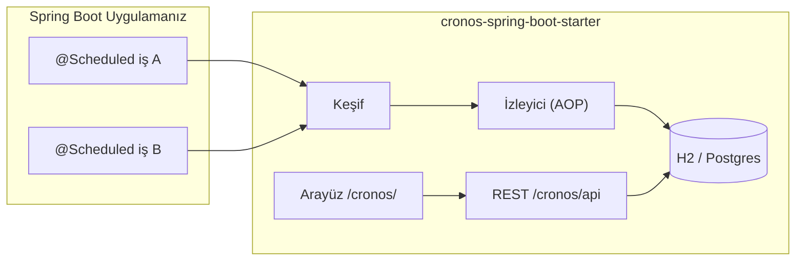

<p align="center">
  
</p>

<p align="center">
  <a href="https://github.com/ibrahimbayramli/cronos/releases/tag/v0.1.0"></a>
  <a href="https://github.com/ibrahimbayramli/cronos/actions/workflows/publish.yml"></a>
</p>

<p align="center">
  
  
  
</p>

<p align="center">
  <strong>Cronos</strong>, <code>@Scheduled</code> işlerinizi otomatik keşfeden, her çalıştırmayı izleyen,
  bir REST API sunan ve modern gömülü bir kontrol paneli sağlayan sıfır yapılandırmalı bir Spring Boot starter'ıdır —
  iş kodunuzu değiştirmenize gerek kalmaz.
</p>

<p align="center">
  <a href="#hızlı-başlangıç">Hızlı Başlangıç</a> ·
  <a href="#projenize-ekleyin">Projenize Ekleyin</a> ·
  <a href="#yayınlanan-artifaktlar">Yayınlanan Artifaktlar</a> ·
  <a href="#yapılandırma">Yapılandırma</a>
</p>

---

## Cronos ne yapar?

Spring Boot uygulamaları genellikle kritik arka plan işlerini `@Scheduled` ile çalıştırır; ancak gözlemlenebilirlik çoğu zaman sonradan düşünülür — merkezi bir iş listesi yoktur, çalıştırma geçmişi tutulmaz, manuel tetikleme için pratik bir yol bulunmaz.

Cronos starter bağımlılığı olarak devreye girer ve otomatik olarak şunları sağlar:

| Özellik | Ne sunar |
|---|---|
| **Keşif** | Başlangıçta tüm `@Scheduled` metodlarını bulur |
| **İzleme** | Başlangıç/bitiş zamanı, süre, durum ve hata durumunda stack trace kaydeder |
| **Kontrol paneli** | `/cronos/` adresinde React + Ant Design arayüzü sunar |
| **REST API** | `/cronos/api` altında işler, geçmiş, sağlık ve manuel tetikleme |
| **Kalıcılık** | Varsayılan olarak gömülü H2 veya uygulamanızın mevcut `DataSource`'u |



> **Sıfır kod değişikliği.** Bağımlılığı ekleyin, `@EnableScheduling` kullanmaya devam edin, uygulamanızı başlatın.

---

## Hızlı başlangıç

**1. Bağımlılığı ekleyin** (Maven veya Gradle — bkz. [Projenize ekleyin](#projenize-ekleyin))

**2. Zamanlamayı etkinleştirin** (henüz yoksa):

```java
@SpringBootApplication
@EnableScheduling
public class MyApplication {
    public static void main(String[] args) {
        SpringApplication.run(MyApplication.class, args);
    }
}
```

**3. Çalıştırın ve kontrol panelini açın:**

```bash
# Maven
mvn spring-boot:run

# Gradle
./gradlew bootRun
```

| Kaynak | URL |
|---|---|
| Kontrol paneli | http://localhost:8080/cronos/ |
| REST API | http://localhost:8080/cronos/api |
| Sağlık | http://localhost:8080/cronos/api/health |

Cronos başlangıçta kontrol paneli ve API URL'lerini loglar.

---

## Yayınlanan artifaktlar

| Paket | Koordinatlar | Kullanım |
|---|---|---|
| **Starter** | `com.github.ibrahimbayramli:cronos-spring-boot-starter:0.1.0` | Otomatik yapılandırma, REST API, gömülü arayüz |

**Kaynak:** [github.com/ibrahimbayramli/cronos](https://github.com/ibrahimbayramli/cronos)

> `cronos-core` dahili bir modüldür; starter JAR'ına gömülür ve ayrıca tüketilmesi gerekmez.

---

## Projenize ekleyin

### Maven

<details open>
<summary><strong>Adım adım</strong></summary>

`pom.xml` dosyanıza ekleyin:

```xml
<dependency>
    <groupId>com.github.ibrahimbayramli</groupId>
    <artifactId>cronos-spring-boot-starter</artifactId>
    <version>0.1.0</version>
</dependency>
```

Senkronize edin ve çalıştırın:

```bash
mvn clean compile
mvn spring-boot:run
```

</details>

### Gradle

<details open>
<summary><strong>Adım adım</strong></summary>

`build.gradle.kts` dosyanıza ekleyin:

```kotlin
dependencies {
    implementation("com.github.ibrahimbayramli:cronos-spring-boot-starter:0.1.0")
}
```

Senkronize edin ve çalıştırın:

```bash
./gradlew clean build
./gradlew bootRun
```

</details>

### Çözümlemeyi doğrulayın

```bash
# Maven — com.github.ibrahimbayramli:cronos-spring-boot-starter:0.1.0 indirilmeli
mvn dependency:get -Dartifact=com.github.ibrahimbayramli:cronos-spring-boot-starter:0.1.0

# Gradle — koordinatları yazdır
./gradlew verifyConsumerGradleSnippet
```

---

## Kutudan çıktığı gibi ne alırsınız

| Uç nokta | Metot | Açıklama |
|---|---|---|
| `/cronos/` | GET | Gömülü kontrol paneli arayüzü |
| `/cronos/api/jobs` | GET | Keşfedilen işleri listeler |
| `/cronos/api/jobs/{id}` | GET | İş detayı + sonraki çalıştırma |
| `/cronos/api/jobs/{id}/executions` | GET | Çalıştırma geçmişi |
| `/cronos/api/jobs/{id}/trigger` | POST | Manuel tetikleme |
| `/cronos/api/health` | GET | Cronos sağlık kontrolü |

---

## Yapılandırma

```yaml
cronos:
  enabled: true
  api-base-path: /cronos/api
  ui-enabled: true
  ui-base-path: /cronos
  execution-retention: 90d
  manual-trigger-pool-size: 4
  datasource:
    url: jdbc:h2:file:./data/cronos;DB_CLOSE_DELAY=-1
    driver-class-name: org.h2.Driver
```

Uygulamanız zaten bir `DataSource` bean'i tanımlıyorsa Cronos onu yeniden kullanır. Aksi halde yukarıdaki ayarlarla gömülü H2 sağlar.

---

## Proje yapısı

| Modül | Açıklama |
|---|---|
| [`cronos-core`](cronos-core/) | Domain varlıkları ve `JobSourceAdapter` SPI |
| [`cronos-spring-boot-starter`](cronos-spring-boot-starter/) | Otomatik yapılandırma, REST API, gömülü arayüz |
| [`cronos-dashboard`](cronos-dashboard/) | React/Vite/Ant Design frontend (starter JAR'ına paketlenir) |

---

## Kaynaktan derleme

```bash
# Tam derleme (kontrol paneli arayüzü dahil)
mvn clean verify

# Daha hızlı CI için arayüz derlemesini atla
mvn clean verify -Dcronos.ui.build.skip=true
```

---

## Sorun giderme

| Sorun | Çözüm |
|---|---|
| Kontrol paneli 404 | `cronos.ui-enabled=true` olduğundan ve `spring.web.resources` ile çakışma olmadığından emin olun |
| İşler listelenmiyor | `@EnableScheduling` mevcut olduğunu ve metodların `@Scheduled` kullandığını doğrulayın |
| Gradle artifaktı bulamıyor | `repositories { mavenCentral() }` tanımlı olduğundan emin olun |

---

## Yol haritası

- [x] Spring `@Scheduled` keşfi
- [x] JPA + Flyway ile çalıştırma izleme
- [x] Manuel tetikleme
- [x] REST API
- [x] Gömülü kontrol paneli arayüzü
- [ ] Maven Central (`com.github.*` koordinatları)
- [ ] WebSocket ile canlı güncellemeler
- [ ] Quartz adaptörü
- [ ] API anahtarı / JWT kimlik doğrulama

---

## Lisans

MIT — bkz. [LICENSE](LICENSE).
