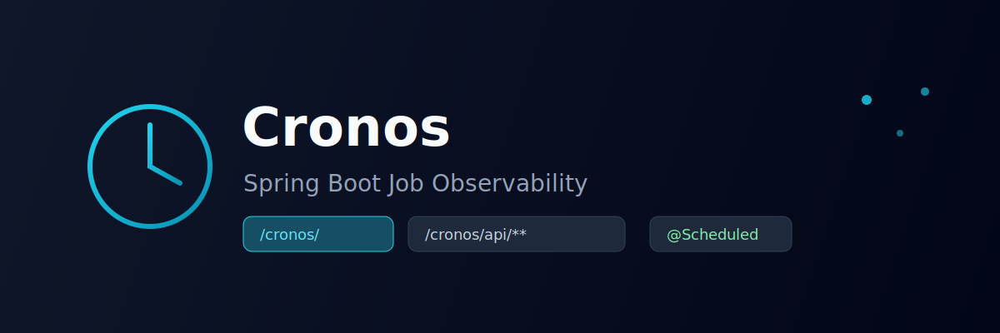

# Cronos Dashboard

<p align="center">
  
</p>

<p align="center">
  React + Ant Design frontend bundled into <code>cronos-spring-boot-starter</code>.
  <br />
  <a href="../README.md#add-to-your-project">Install Cronos in your project</a> ·
  <a href="http://localhost:8080/cronos/">Embedded UI</a>
</p>

---

## What it does

The dashboard is the visual layer of [Cronos](../README.md). It connects to the Cronos REST API and shows:

- All discovered `@Scheduled` jobs
- Next run estimates and cron expressions
- Execution history with duration and status
- Manual trigger actions

In production, the built assets ship inside the starter JAR — **no separate frontend deployment**.

---

## Embedded mode (production)

When your app depends on `cronos-spring-boot-starter`:

```
http://localhost:8080/cronos/
```

Add the starter from [GitHub Packages](../README.md#add-to-your-project) — the UI is included automatically.

---

## Standalone development

Run the Vite dev server against a local Spring Boot backend:

```bash
npm install
npm run dev
```

Open http://localhost:5173/cronos/ — API requests proxy to `http://localhost:8080`.

---

## Stack

| Layer | Technology |
|---|---|
| UI | React 19 + TypeScript |
| Build | Vite 8 |
| Components | Ant Design 5 (dark theme) |
| Routing | React Router |

---

## Build

```bash
npm run build
```

Output is copied into the starter JAR during `mvn package` at `classpath:/static/cronos/`.

To skip the UI build in CI:

```bash
mvn clean verify -Dcronos.ui.build.skip=true
```

---

## Configuration

```yaml
cronos:
  ui-enabled: true
  ui-base-path: /cronos
  api-base-path: /cronos/api
```

See the [main README](../README.md#configuration) for all Cronos properties.
